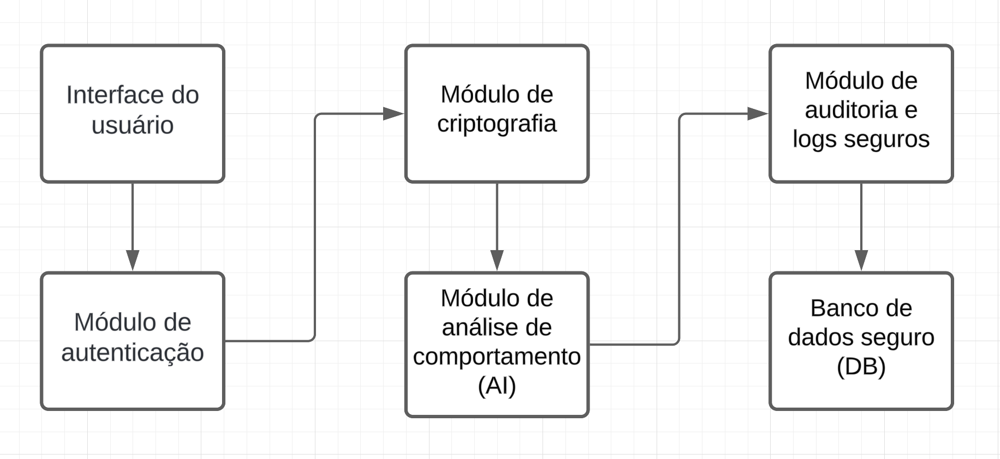

# ponderada_M7S6

## Introdução

&emsp;&emsp; Com o avanço do uso de sistemas conversacionais em diversos setores, incluindo o financeiro, surgem desafios significativos no que diz respeito à segurança das informações transmitidas e processadas. Em um ambiente regulado como o da indústria financeira no Brasil, que lida com dados sensíveis e regulamentações rigorosas, garantir a integridade, confidencialidade e autenticidade das interações é fundamental. Sistemas conversacionais como chatbots ou assistentes virtuais são frequentemente alvos de ataques cibernéticos que buscam explorar vulnerabilidades para obter informações valiosas. Dentre os principais riscos, destacam-se ataques de injeção de código, vazamento de dados, interceptação de comunicações e engenharia social, que podem comprometer tanto a reputação quanto a conformidade de uma organização com legislações como a Lei Geral de Proteção de Dados (LGPD) [ZIMMER, 2022](#referências).

&emsp;&emsp; Neste contexto, melhorar os requisitos não funcionais de segurança em sistemas conversacionais torna-se um imperativo para assegurar que esses sistemas operem dentro dos parâmetros esperados de proteção de dados e regulamentações financeiras. A implementação de controles completos de segurança deve ser considerada em todas as fases do ciclo de desenvolvimento, abordando desde a autenticação de usuários até a criptografia de comunicações e a prevenção de ataques sofisticados.

## Solução proposta

&emsp;&emsp; Para abordar as vulnerabilidades e reforçar a segurança do sistema conversacional no contexto regulatório financeiro, propomos uma arquitetura modular que integra as melhores práticas de segurança da informação. A arquitetura sugerida está dividida em cinco principais módulos, cada um com responsabilidades específicas que, em conjunto, garantem a proteção do sistema. O diagrama abaixo ilustra a arquitetura proposta:

1. **Interface do usuário**: este módulo é responsável pela interação direta com o usuário, coletando suas entradas e exibindo as respostas do sistema conversacional. Para garantir a segurança, todas as comunicações entre o usuário e a interface são criptografadas utilizando HTTPS com TLS 1.3, minimizando o risco de interceptação de dados. A interface deve ser desenhada com práticas de prevenção contra ataques de injeção, como SQL Injection e Cross-Site Scripting (XSS).

2. **Módulo de autenticação**: implementa mecanismos de autenticação multifator (MFA) para verificar a identidade dos usuários. Utilizando biometria e tokens temporários gerados por aplicativos, este módulo garante que apenas usuários autorizados tenham acesso ao sistema. Além disso, faz uso de OAuth 2.0 para integração com sistemas de autenticação de terceiros.

3. **Módulo de criptografia**: responsável pela criptografia de dados em trânsito e em repouso. Dados sensíveis, como informações de transações financeiras e dados pessoais, são criptografados utilizando algoritmos como AES-256 e RSA-2048. Este módulo também gerencia a rotação periódica de chaves de criptografia para garantir a proteção contínua contra possíveis violações.

4. **Módulo de análise de comportamento (AI)**: utiliza inteligência artificial para monitorar o comportamento dos usuários e detectar atividades suspeitas. Este módulo emprega técnicas de machine learning para identificar padrões anômalos que possam indicar tentativas de fraude, como acessos repetidos de endereços IP desconhecidos ou comportamentos que desviam do padrão esperado. Em caso de detecção, são acionados alertas automáticos para o time de segurança e solicitada uma reautenticação do usuário.

5. **Módulo de auditoria e logs seguros**: armazena registros detalhados de todas as interações realizadas no sistema, garantindo que esses logs sejam imutáveis e acessíveis apenas por pessoal autorizado. Esses logs são criptografados e assinados digitalmente, garantindo sua integridade e servindo como evidência em caso de auditorias internas ou externas. Além disso, é integrado com sistemas de detecção de intrusões (IDS) que monitoram tentativas de acesso não autorizado.

6. **Banco de Dados Seguro (DB)**: O banco de dados é protegido por mecanismos de encriptação e acesso controlado por privilégios. Além disso, possui backups periódicos com dados criptografados para garantir a recuperação segura em caso de falha ou ataque de ransomware. O banco de dados opera dentro de uma rede privada, minimizando sua exposição a ataques externos.

## Referências

ZIMMER, Kelvin. Vazamento de dados é prejuízo certo para empresas. Lumiun Blog, 2 mar. 2022. Disponível em: https://www.lumiun.com/blog/vazamento-de-dados-e-prejuizo-certo-para-empresas/. Acesso em: 15 set. 2024.
